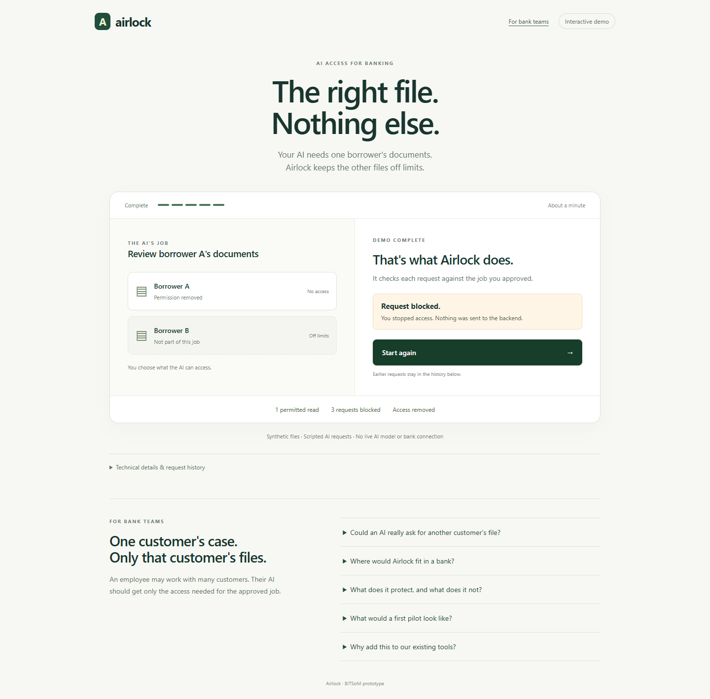

# Airlock: task access for banking AI

A synthetic, local prototype prepared for the BITSoM Builders Pitch Fest 2026 BFSI track.

An analyst may access two borrowers. An agent assigned borrower A should not inherit access to borrower B. Airlock checks the trusted assignment at execution and records the decision and actual backend result.

[Watch the 3:15 captioned walkthrough](demo/Airlock-demo.mp4) · [Testing guide](docs/TESTING.md) · [Website](https://airlock.ing/) · [Public protocol foundation](https://github.com/airlock-protocol/airlock)



## Run locally

Install Python 3.12 and `uv`, then run these commands in this repository:

```powershell
uv sync --frozen --extra dev
uv run --frozen --no-sync python -m airlock_checkpoint.submission
```

First setup downloads dependencies. No API key or real customer data is required. Open the private launch URL printed by the server. It binds to `127.0.0.1:8801` only. If that port is in use, append `--port 8802` to the Python command. Keep the temporary launch credential private. Stop with Ctrl+C.

## What to try

1. Create an assignment for borrower A.
2. Read A. The request reaches a separately credentialed HTTP mock backend.
3. Attempt B. The request is denied before dispatch.
4. Attempt an external upload. The unsupported operation is denied.
5. Revoke the assignment, then read A again. The request is denied.
6. Inspect and download the signed evidence.

A clean run produces one completed backend read and three denials. New assignments do not clear the current run's evidence. Restart for fresh counters.

## Verified behavior

48 automated tests cover the existing policy foundation and new demonstration. Tests include task and tenant binding, forged identity fields, direct backend bypass, expiry, revocation ordering, policy failure, evidence-write failure and signed-export tampering. Desktop and mobile browser testing covered the click flow and evidence download.

```powershell
uv run --frozen --no-sync python -m pytest -q
uv run --frozen --no-sync ruff check airlock_checkpoint/submission tests/test_submission.py
uv run --frozen --no-sync python -m airlock_checkpoint.submission --verify demo/sample-evidence.json
```

## Scope and limitations

The agent requests are scripted and document extraction is deterministic. No live LLM, bank connection, customer data, loan decision, customer pilot or regulatory certification is claimed.

Separate local credentials demonstrate the execution path. They do not replace production SSO, workload identity, host isolation or key custody. Local administrators can inspect process memory and modify storage. SQLite retains events, while assignments, signing keys and the mock backend ledger are per-run. Restart invalidates prior assignments.

An Ed25519 signature establishes integrity of the exported snapshot under its key. It does not establish completeness or policy correctness. Use `--public-key` with an independently recorded key when verifying the signer.

This is a public evaluation copy. The broader private Airlock repository and its business materials are not included. The existing public protocol project has its own license and scope.

## Contact

Shivdeep Singh, founder of Airlock. Contact: [shivdeepsachdeva@gmail.com](mailto:shivdeepsachdeva@gmail.com).
